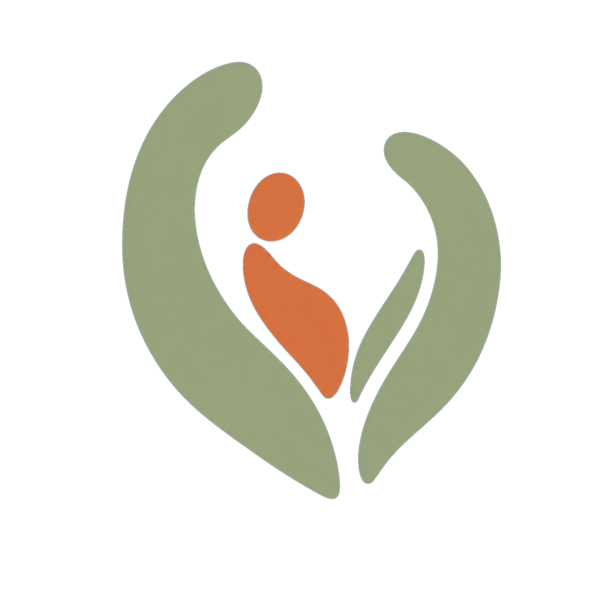
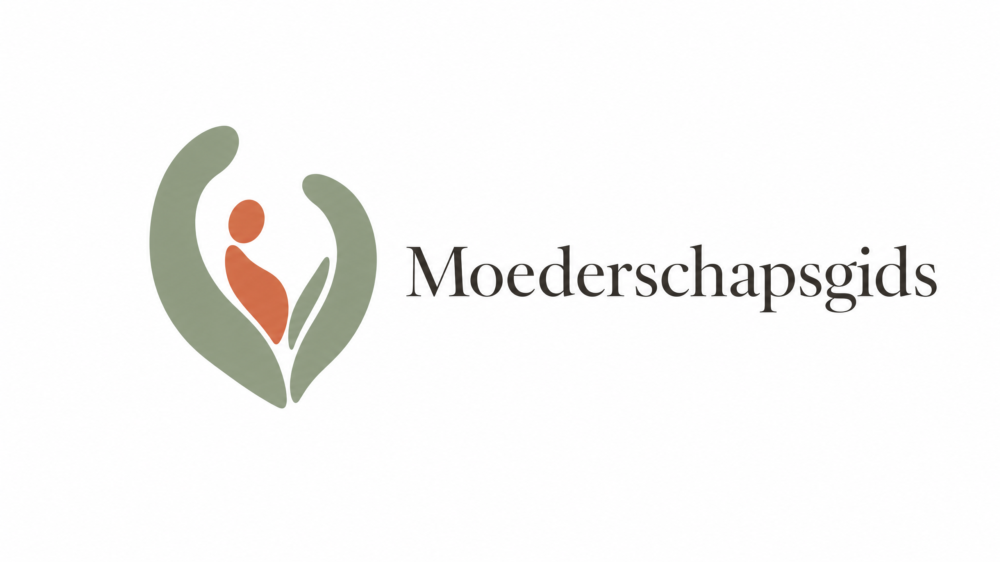
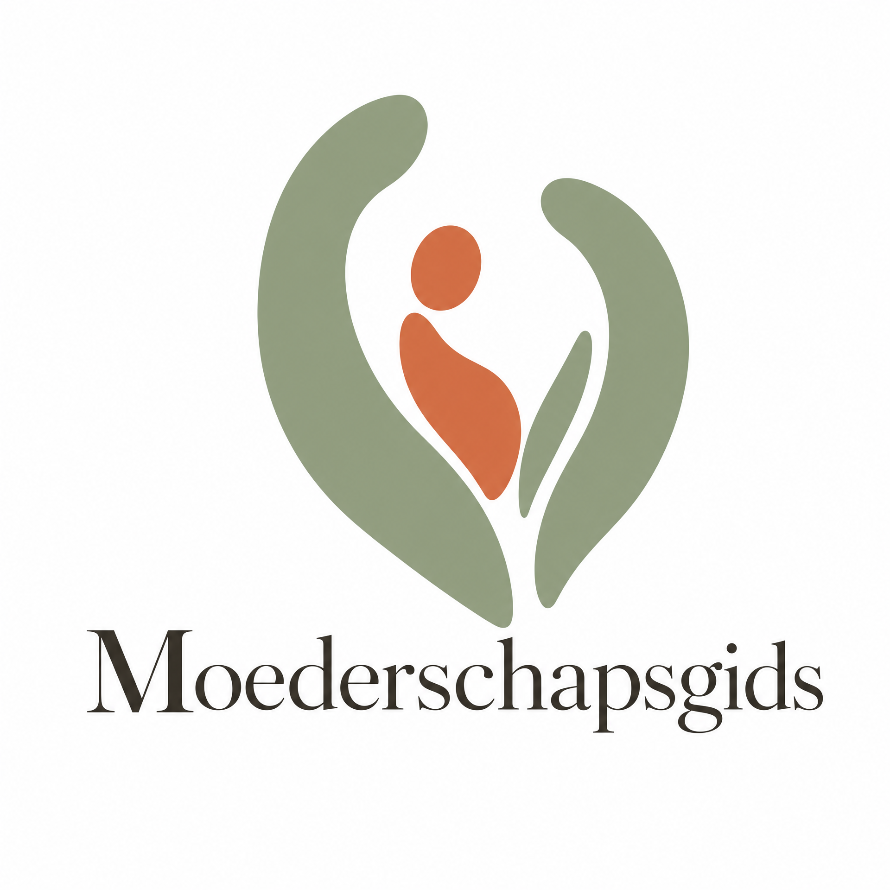
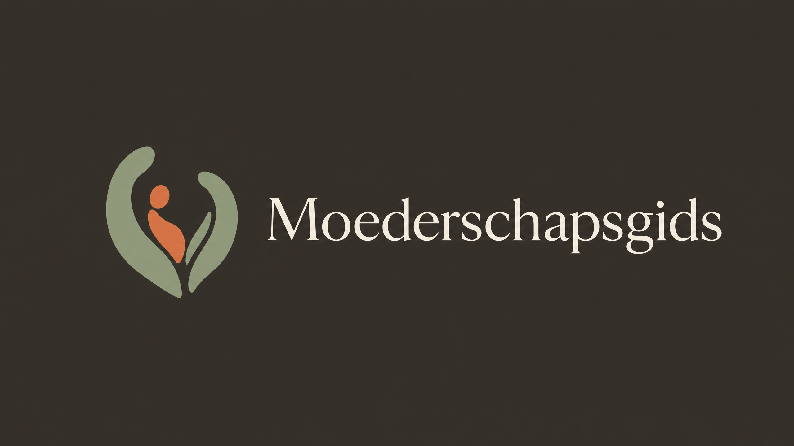
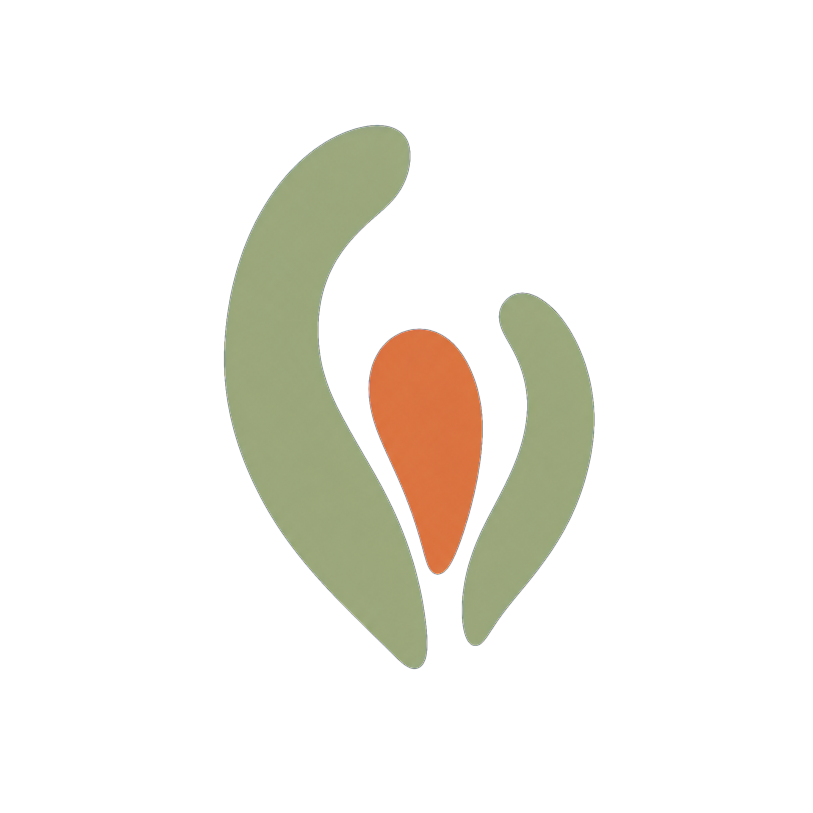
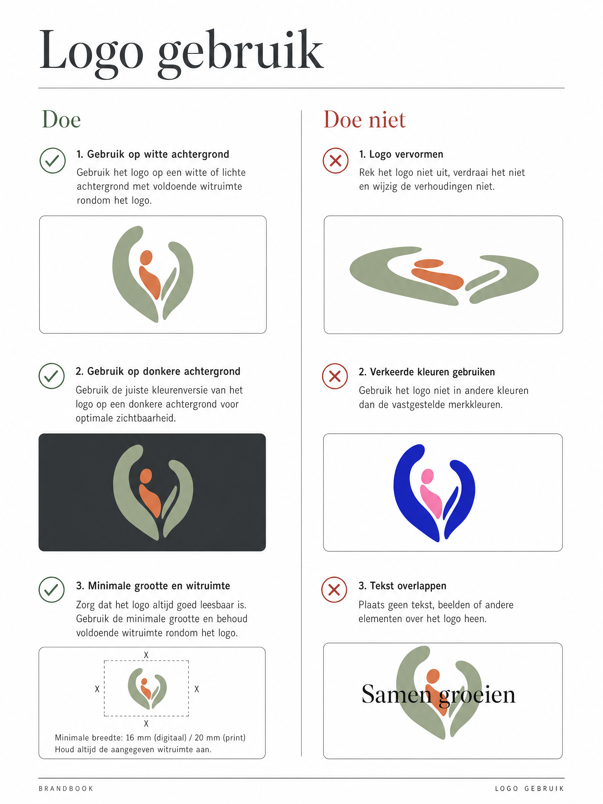
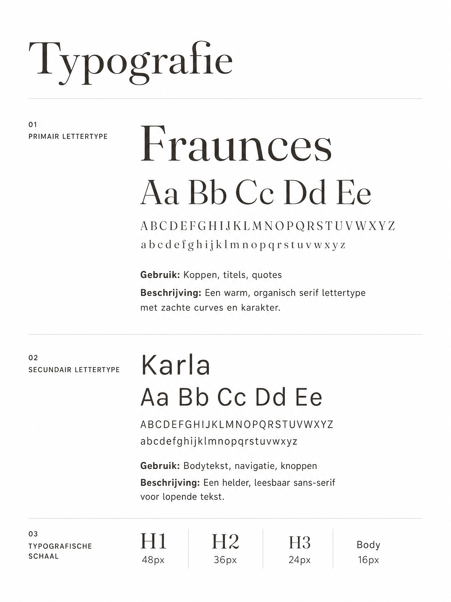
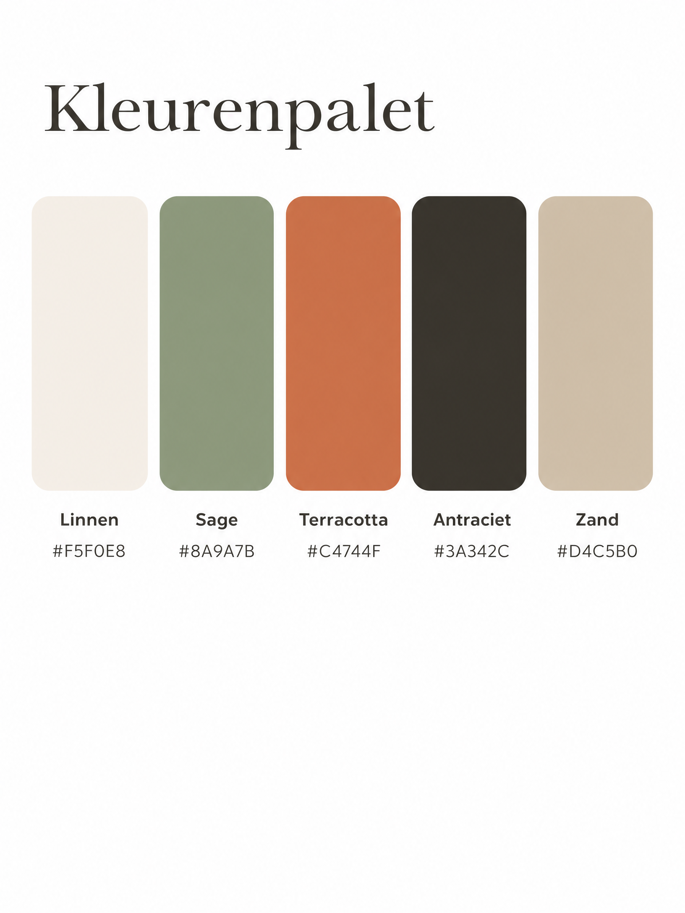
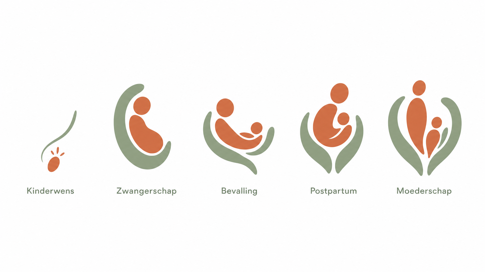

# Brandbook Moederschapsgids

## Inhoudsopgave
1. [Merkverhaal & Positionering](#1-merkverhaal--positionering)
2. [Het Logo](#2-het-logo)
3. [Typografie](#3-typografie)
4. [Kleurenpalet](#4-kleurenpalet)
5. [Fase-iconen](#5-fase-iconen)
6. [Beeldtaal & Fotografie](#6-beeldtaal--fotografie)
7. [Tone of Voice](#7-tone-of-voice)
8. [Toepassingen](#8-toepassingen)

---

## 1. Merkverhaal & Positionering

**Moederschapsgids** is dé gecureerde, holistische gids voor vrouwen in Nederland die op zoek zijn naar de juiste zorgverleners rondom zwangerschap en moederschap. Het platform biedt een compleet, veilig en betrouwbaar overzicht binnen vijf belangrijke fases: van kinderwens tot moederschap.

**Kernwaarden:**
* **Warm & Omvattend:** We bieden een veilige haven, een warme omarming.
* **Betrouwbaar & Gecureerd:** We zijn een gids met autoriteit en kwaliteit.
* **Menselijk & Organisch:** Geen kille medische benadering, maar natuurlijke groei en verbinding.
* **Compleet:** De enige kaart in Nederland die het hele landschap in kaart brengt.

---

## 2. Het Logo

Het logo van Moederschapsgids is een asymmetrische, organische vorm die een beschermende omarming symboliseert. Binnen deze veilige, sage groene ruimte bevindt zich een terracotta figuur, wat staat voor de (aanstaande) moeder. De asymmetrie geeft het logo een natuurlijk, menselijk karakter, terwijl de balans rust en vertrouwen uitstraalt.

### Beeldmerk

### Primaire Lockup (Horizontaal)
De primaire versie van het logo plaatst het beeldmerk links en het woordmerk rechts. Dit is de standaard voor website-headers en documenten.

### Gestapelde Lockup
Voor vierkante toepassingen (social profielfoto, drukwerk).

### Donkere Achtergrond
Voor donkere toepassingen (zoals de Antraciet achtergrond) wordt het woordmerk in de kleur Linnen gezet. Het beeldmerk behoudt zijn originele kleuren.

### Favicon & App Icoon
Voor extreem kleine toepassingen gebruiken we een vereenvoudigde, compacte versie van het beeldmerk.

### Logo Gebruik (Do's & Don'ts)

---

## 3. Typografie

De typografie van Moederschapsgids combineert een warme, karaktervolle schreefletter (serif) met een heldere, moderne schreefloze letter (sans-serif).

### Primair: Fraunces (of vergelijkbare warme serif)
**Gebruik:** Koppen, titels, quotes, en het woordmerk.
**Karakter:** Fraunces is een organische serif met zachte curves. Het brengt redactionele elegantie, warmte en een vleugje nostalgie, wat perfect past bij het thema moederschap.

### Secundair: Karla (of vergelijkbare heldere sans-serif)
**Gebruik:** Bodytekst, navigatie, knoppen, kleine labels.
**Karakter:** Karla is een grotesk lettertype dat zeer goed leesbaar is op schermen. Het biedt een rustig, modern contrast met de meer expressieve koppen.

---

## 4. Kleurenpalet

Het kleurenpalet is geïnspireerd op de natuur en aarde. Het is zacht, vrouwelijk zonder cliché te zijn, en straalt tegelijkertijd professionaliteit uit.

* **Linnen (#F5F0E8):** De primaire achtergrondkleur. Een warme off-white die zachter is voor de ogen dan puur wit.
* **Sage (#8A9A7B):** De primaire merkkleur. Een gedempte, aardse groen die staat voor groei, rust en natuurlijkheid.
* **Terracotta (#C4744F):** De accentkleur. Brengt warmte, energie en menselijkheid. Gebruikt voor knoppen, links en de figuur in het logo.
* **Antraciet (#3A342C):** De tekstkleur. Een diepe, warme houtskoolkleur die zachter is dan puur zwart.
* **Zand (#D4C5B0):** Een secundaire neutrale kleur voor vlakken, kaders en subtiele scheidingen.

---

## 5. Fase-iconen

Moederschapsgids begeleidt vrouwen door vijf specifieke fases. Voor deze fases is een op maat gemaakte iconenset ontworpen die de beeldtaal van het hoofdlogo volgt: sage groene beschermende vormen rondom terracotta elementen.

1. **Kinderwens:** Een zaadje/vonk met een wensende boog.
2. **Zwangerschap:** De groeiende buik in een beschermende vorm.
3. **Bevalling:** De overgang en beweging van twee vormen.
4. **Postpartum:** De moeder die het kind vasthoudt, gedragen door de omgeving.
5. **Moederschap:** De opgroeiende figuren, samen in een compleet kader.

---

## 6. Beeldtaal & Fotografie

De fotografie van Moederschapsgids moet de volgende eigenschappen hebben:
* **Licht & Warm:** Gebruik van natuurlijk licht, zachte schaduwen, 'golden hour' sfeer.
* **Echt & Ongeregisseerd:** Geen stijve stock-foto poses. Momenten die oprecht voelen.
* **Focus op Connectie:** Beelden van handen, omhelzingen, en de blik tussen moeder en kind of zorgverlener en moeder.
* **Kleuraansluiting:** Foto's moeten harmoniëren met het Linnen, Sage en Terracotta palet (aardetinten in kleding en omgeving).

---

## 7. Tone of Voice

Hoe Moederschapsgids klinkt in tekst:
* **Invoelend maar nuchter:** We begrijpen de emotie, maar we blijven een praktische, betrouwbare gids. Geen zweverig of over-emotioneel taalgebruik.
* **Inclusief:** We spreken alle moeders aan, in elke vorm en op elke manier.
* **Expertise met een zachte stem:** We stralen autoriteit uit door curatie en kwaliteit, maar we spreken de lezer aan als een warme vriendin die de weg weet.

---

## 8. Toepassingen

### Website
De website is de belangrijkste uiting van het merk. Het ontwerp is ruimtelijk (veel 'Linnen' witruimte), met duidelijke typografische hiërarchie en warme fotografie.

### Social Media
Op Instagram en andere kanalen combineren we fotografie met typografische quotes en educatieve carrousels.

